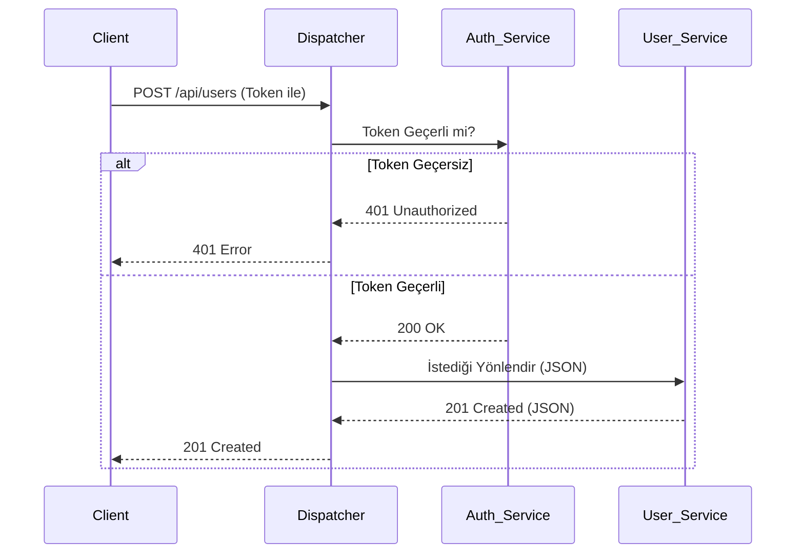

# [cite_start]Kocaeli Üniversitesi - Bilişim Sistemleri Mühendisliği 
## [cite_start]Yazılım Geliştirme Laboratuvarı-II Dersi - Proje 1 
### [cite_start]Mikroservis Mimarisi ve Dispatcher (API Gateway) Uygulaması [cite: 13]

[cite_start]**Ekip Üyeleri:** [cite: 77]
* Rıdvan
* Muhammed Enes Omar
[cite_start]**Tarih:** 5 Nisan 2026 [cite: 77, 112]

---

### [cite_start]1. Problem Tanımı ve Amaç [cite: 78]
Geleneksel monolitik yazılım mimarileri, sistem büyüdükçe ölçeklendirme ve bakım zorlukları yaratmaktadır. Bu projenin amacı; modern yazılım geliştirme süreçlerine uygun olarak, bağımsız mikroservislerden oluşan, yüksek trafiği kaldırabilen ve güvenli bir sosyal ağ backend sistemi geliştirmektir. [cite_start]Tüm dış istekler merkezi bir Dispatcher üzerinden yönetilmiş, sistemin hata payı minimize edilerek güvenli ve ölçeklenebilir bir yapı tasarlanmıştır[cite: 13, 14].

### [cite_start]2. Richardson Olgunluk Modeli (RMM) ve RESTful Mimari [cite: 79]
[cite_start]Projemizdeki tüm mikroservis API'leri, **Richardson Olgunluk Modeli (RMM) Seviye 2** standartlarına sıkı sıkıya bağlı kalınarak geliştirilmiştir[cite: 58]. 
* **Kaynak (Resource) Tabanlı URI:** Sistemdeki her varlık (`User`, `Post`) benzersiz URI'ler üzerinden dışa açılmıştır (Örn: `/api/users/`). [cite_start]İşlemler URL parametreleriyle (örn: `?delete=1`) değil, standart kaynak yollarıyla yapılmıştır[cite: 59, 60].
* [cite_start]**HTTP Fiillerinin Doğru Kullanımı:** CRUD işlemleri için `GET`, `POST`, `PUT`, `DELETE` metotları amacına uygun kullanılmıştır[cite: 59].
* [cite_start]**HTTP Durum Kodları:** Başarılı işlemlerde `200 OK` veya `201 Created`, yetkisiz erişimlerde `401 Unauthorized`, sunucu hatalarında ise uygun `5xx` kodları dönülerek her zaman "200 OK" dönme hatasına düşülmemiştir[cite: 41, 42, 59].

### [cite_start]3. TDD, OOP ve Sistem Tasarımı [cite: 89, 97]
* [cite_start]**Test-Driven Development (TDD):** Sistemin giriş noktası olan Dispatcher servisi, **Red-Green-Refactor** döngüsüyle geliştirilmiştir[cite: 38]. [cite_start]Test dosyalarının zaman damgaları, fonksiyonel kodlardan önce oluşturularak TDD disiplini kanıtlanmıştır[cite: 27].
* [cite_start]**Nesne Yönelimli Programlama (OOP):** Proje genelinde SOLID prensiplerine sadık kalınmış, soyutlama ve arayüz (interface) kullanımı ile modüler bir yapı kurulmuştur[cite: 31].

### [cite_start]4. Sistem Mimarisi ve Veri İzolasyonu (Mermaid Diyagramı) 
[cite_start]Sistem; bir Dispatcher, bir Auth servisi ve iki işlevsel mikroservis (User ve Post) olmak üzere toplam 4 bağımsız üniteden oluşmaktadır[cite: 36]. [cite_start]Her servisin kendine ait bağımsız bir NoSQL veri tabanı (MongoDB/Redis) bulunmaktadır[cite: 45]. [cite_start]Mikroservisler sadece iç ağda (Network Isolation) çalışır, dış dünyaya kapalıdır[cite: 48, 49].

```mermaid
graph TD
    Client((Client)) -->|HTTP Requests| Dispatcher[Dispatcher / API Gateway]
    
    subgraph İç Ağ (Network Isolation)
        Dispatcher -->|Yetki Kontrolü| Auth[Auth Service]
        Auth -->|Token Cache| Redis1[(Redis - Auth)]
        
        Dispatcher -->|Yönlendirme| User[User Service]
        User -->|Bağımsız Veri| Mongo1[(MongoDB - User)]
        
        Dispatcher -->|Yönlendirme| Post[Post Service]
        Post -->|Bağımsız Veri| Mongo2[(MongoDB - Post)]
    end
```

### [cite_start]5. İş Akışı ve Sequence (Sıralama) Diyagramı [cite: 79]
[cite_start]Yetkilendirme mantığı mikroservislere gömülmemiş, doğrudan Dispatcher üzerinden kontrol edilerek servislerin güvenliği sağlanmıştır[cite: 40, 48].



### [cite_start]6. Kurulum ve Çalıştırma [cite: 56]
[cite_start]Proje tamamen Dockerize edilmiştir[cite: 56]. Tüm sistemi ayağa kaldırmak için terminalde proje dizinine giderek aşağıdaki komutu çalıştırmak yeterlidir:
```bash
docker-compose up -d --build
```

### [cite_start]7. Performans ve Yük Testleri (Locust) [cite: 82]
[cite_start]Sistemin yoğun trafik altındaki dayanıklılığı profesyonel bir yük testi aracı olan **Locust** ile ölçülmüştür[cite: 33, 72]. 

* [cite_start]**Test Senaryosu:** 50, 100, 200 ve 500 eşzamanlı istek (Concurrent Users)[cite: 74].
* [cite_start]**Ölçülen Değerler:** Dispatcher üzerinden Health Check, User Oluşturma ve Auth işlemleri simüle edilmiştir[cite: 73].
* [cite_start]**Sonuçlar:** Sistem 500 eşzamanlı istekte bile %0 hata oranıyla (0 Fails) çalışmış, ortalama yanıt süresi 10ms altında kalarak yüksek bir performans sergilemiştir[cite: 74]. [cite_start]Yetkisiz istekler başarıyla HTTP 4xx kodlarıyla reddedilmiştir[cite: 41]. *(Ekran görüntüleri `docs/tests` klasöründe yer almaktadır).*

### [cite_start]8. Sonuç ve Tartışma [cite: 83]
**Başarılar:** TDD disipliniyle hatasız bir Dispatcher geliştirilmiş, Docker ile tam izolasyon sağlanmış ve RMM Seviye 2 standartları yakalanmıştır. 
**Sınırlılıklar:** Trafik analizi için şu an Locust arayüzü kullanılmaktadır, gelişmiş metrikler için Grafana gibi harici paneller sisteme eklenebilir. 
**Olası Geliştirmeler:** Gelecek fazlarda HATEOAS entegrasyonu yapılarak projenin RMM Seviye 3'e yükseltilmesi planlanmaktadır.
