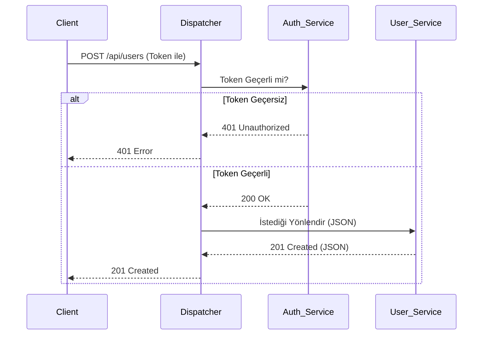

# Kocaeli Üniversitesi - Bilişim Sistemleri Mühendisliği
## Yazılım Geliştirme Laboratuvarı-II Dersi - Proje 1
### Mikroservis Mimarisi ve Dispatcher (API Gateway) Uygulaması

**Ekip Üyeleri:**
* Rıdvan Elen
* Muhammed Enes Omar
**Tarih:** 5 Nisan 2026

---

### 1. Problem Tanımı ve Amaç
Geleneksel monolitik yazılım mimarileri, sistem büyüdükçe ölçeklendirme ve bakım zorlukları yaratmaktadır. Bu projenin amacı; modern yazılım geliştirme süreçlerine uygun olarak, bağımsız mikroservislerden oluşan, yüksek trafiği kaldırabilen ve güvenli bir sosyal ağ backend sistemi geliştirmektir. Tüm dış istekler merkezi bir Dispatcher üzerinden yönetilmiş, sistemin hata payı minimize edilerek güvenli ve ölçeklenebilir bir yapı tasarlanmıştır.

### 2. Richardson Olgunluk Modeli (RMM) ve RESTful Mimari
Projemizdeki tüm mikroservis API'leri, **Richardson Olgunluk Modeli (RMM) Seviye 2** standartlarına sıkı sıkıya bağlı kalınarak geliştirilmiştir. 
* **Kaynak (Resource) Tabanlı URI:** Sistemdeki her varlık (`User`, `Post`) benzersiz URI'ler üzerinden dışa açılmıştır (Örn: `/api/users/`). İşlemler URL parametreleriyle (örn: `?delete=1`) değil, standart kaynak yollarıyla yapılmıştır.
* **HTTP Fiillerinin Doğru Kullanımı:** CRUD işlemleri için `GET`, `POST`, `PUT`, `DELETE` metotları amacına uygun kullanılmıştır.
* **HTTP Durum Kodları:** Başarılı işlemlerde `200 OK` veya `201 Created`, yetkisiz erişimlerde `401 Unauthorized`, sunucu hatalarında ise uygun `5xx` kodları dönülerek her zaman "200 OK" dönme hatasına düşülmemiştir.

### 3. TDD, OOP ve Sistem Tasarımı
* **Test-Driven Development (TDD):** Sistemin giriş noktası olan Dispatcher servisi, **Red-Green-Refactor** döngüsüyle geliştirilmiştir. Test dosyalarının zaman damgaları, fonksiyonel kodlardan önce oluşturularak TDD disiplini kanıtlanmıştır.
* **Nesne Yönelimli Programlama (OOP):** Proje genelinde SOLID prensiplerine sadık kalınmış, soyutlama ve arayüz (interface) kullanımı ile modüler bir yapı kurulmuştur.

### 4. Sistem Mimarisi ve Veri İzolasyonu
Sistem; bir Dispatcher, bir Auth servisi ve iki işlevsel mikroservis (User ve Post) olmak üzere toplam 4 bağımsız üniteden oluşmaktadır. Her servisin kendine ait bağımsız bir NoSQL veri tabanı (MongoDB/Redis) bulunmaktadır. Mikroservisler sadece iç ağda (Network Isolation) çalışır, dış dünyaya kapalıdır.

```mermaid
graph TD
    Client((Client)) -->|HTTP Requests| Dispatcher[Dispatcher / API Gateway]
    
    subgraph İç Ağ (Network Isolation)
        Dispatcher -->|Yetki Kontrolü| Auth[Auth Service]
        Auth -->|Token Cache| Redis1[(Redis - Auth)]
        
        Dispatcher -->|Yönlendirme| User[User Service]
        User -->|Bağımsız Veri| Mongo1[(MongoDB - User)]
        
        Dispatcher -->|Yönlendirme| Post[Post Service]
        Post -->|Bağımsız Veri| Mongo2[(MongoDB - Post)]
    end
```

### 5. İş Akışı ve Sequence (Sıralama) Diyagramı
Yetkilendirme mantığı mikroservislere gömülmemiş, doğrudan Dispatcher üzerinden kontrol edilerek servislerin güvenliği sağlanmıştır.



### 6. Kurulum ve Çalıştırma
Proje tamamen Dockerize edilmiştir. Tüm sistemi ayağa kaldırmak için terminalde proje dizinine giderek aşağıdaki komutu çalıştırmak yeterlidir:
```bash
docker-compose up -d --build
```

### 7. Performans ve Yük Testleri (Locust)
Sistemin yoğun trafik altındaki dayanıklılığı profesyonel bir yük testi aracı olan **Locust** ile ölçülmüştür. 

* **Test Senaryosu:** 50, 100, 200 ve 500 eşzamanlı istek (Concurrent Users).
* **Ölçülen Değerler:** Dispatcher üzerinden Health Check, User Oluşturma ve Auth işlemleri simüle edilmiştir.
* **Sonuçlar:** Sistem 500 eşzamanlı istekte bile %0 hata oranıyla (0 Fails) çalışmış, ortalama yanıt süresi 10ms altında kalarak yüksek bir performans sergilemiştir. Yetkisiz istekler başarıyla HTTP 4xx kodlarıyla reddedilmiştir. *(Ekran görüntüleri `docs/tests` klasöründe yer almaktadır).*

### 8. Sonuç ve Tartışma
**Başarılar:** TDD disipliniyle hatasız bir Dispatcher geliştirilmiş, Docker ile tam izolasyon sağlanmış ve RMM Seviye 2 standartları yakalanmıştır. 
**Sınırlılıklar:** Trafik analizi için şu an Locust arayüzü kullanılmaktadır, gelişmiş metrikler için Grafana gibi harici paneller sisteme eklenebilir. 
**Olası Geliştirmeler:** Gelecek fazlarda HATEOAS entegrasyonu yapılarak projenin RMM Seviye 3'e yükseltilmesi planlanmaktadır.
